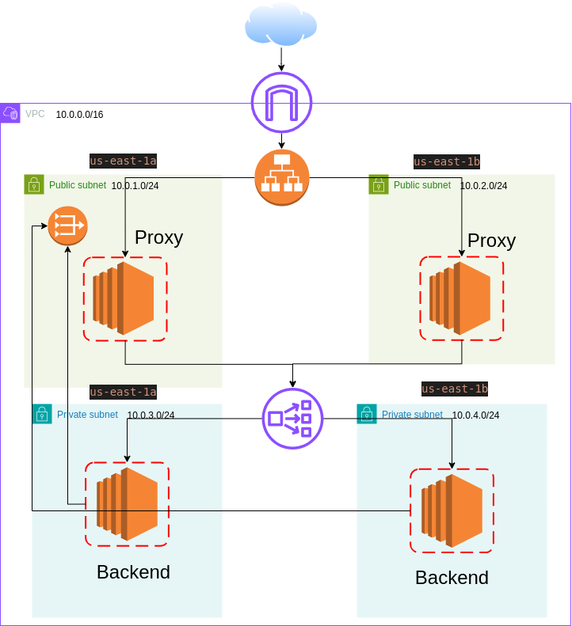
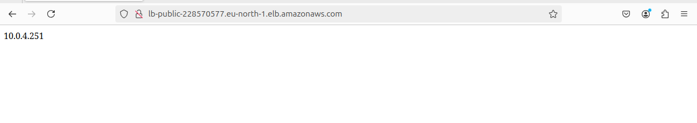

# Terraform EC2 and Load Balancer Deployment

This project deployment of a highly available and scalable infrastructure on AWS using Terraform. The architecture includes multiple EC2 instances, both public and private, behind load balancers, with traffic managed via NGINX proxies. A NAT Gateway is used to enable internet access for private EC2 instances. The state of the infrastructure is stored in an S3 bucket for remote state management.

## Table of Contents

1. [Architecture Overview](#architecture-overview)
2. [Features](#features)
3. [Project Structure](#project-structure)
4. [Requirements](#requirements)
5. [Setup Instructions](#setup-instructions)
    - [1. Clone the repository](#1-clone-the-repository)
    - [2. Initialize Terraform](#2-initialize-terraform)
    - [3. Set up Remote State](#3-set-up-remote-state)
    - [4. Deploy the Infrastructure](#4-deploy-the-infrastructure)
    - [5. Access Public Load Balancer](#5-access-public-load-balancer)
    - [6. View All IPs](#6-view-all-ips)
    - [7. Cleanup](#7-cleanup)
6. [Customization](#customization)
7. [Screenshots](#screenshots)


## Architecture Overview

1. **Public Load Balancer**: Receives traffic from the internet and forwards it to the public EC2 instances.
2. **Public EC2 Instances**: Serve as reverse proxies using NGINX to forward traffic to a private load balancer.
3. **Private Load Balancer**: Manages traffic between the public EC2 instances and the private EC2 instances.
4. **Private EC2 Instances**: Return their private IP address when accessed.
5. **Remote State**: Stored in an S3 bucket.
6. **NAT Gateway**: Enables the private EC2 instances to access the internet when needed.

## Features

- **Custom Terraform Modules**: Utilizes custom modules to manage EC2 instances, load balancers, and VPC resources.
- **Remote State Management**: The Terraform state file is stored in an S3 bucket for safe storage and collaboration.
- **Dynamic IP Output**: Public and private IPs of the EC2 instances are stored in a file (`all-ips.txt`).
- **Automated Provisioning**: NGINX is installed on EC2 instances via remote provisioner.
- **Scalable and Secure**: Combines public and private EC2 instances with NAT Gateway for secure traffic management.

## Project Structure

```bash
terraform-ec2-loadbalancer-deployment/
├── auto_var.auto.tfvars           # Automatically loaded variables
├── destroy_all.sh                 # Script to destroy all resources
├── main.tf                        # Main Terraform configuration
├── modules/                       # Custom Terraform modules
│   ├── ec2-instance/              # EC2 module
│   │   ├── main.tf
│   │   ├── outputs.tf
│   │   ├── private_user_data.sh   # NGINX config for private instances
│   │   ├── public_user_data.sh    # NGINX config for public instances
│   │   └── variables.tf
│   ├── load-balancer/             # Load Balancer module
│   │   ├── main.tf
│   │   ├── outputs.tf
│   │   └── variables.tf
│   └── vpc/                       # VPC module for networking
│       ├── main.tf
│       ├── outputs.tf
│       └── variables.tf
├── outputs.tf                     # Terraform outputs
├── provider.tf                    # Provider configuration (AWS)
├── README.md                      # Project documentation (this file)
├── remote-state-setup/            # Remote state management setup
│   └── main.tf
├── Screenshots/                   # Folder containing project screenshots
│   ├── 1.png
│   ├── 2.png
│   ├── drawio.png
│   ├── Screenshot from 2024-09-16 01-33-45.png
│   └── Screenshot from 2024-09-16 01-38-17.png
├── setup.sh                       # Script to automate setup
├── Task.md                        # Task description and instructions
├── terraform.tfstate              # Current Terraform state file
├── terraform.tfstate.backup       # Backup of the previous state
└── variables.tf                   # Input variables for the project
```

## Requirements
- **Terraform**: Ensure Terraform is installed on your system.
- **AWS Account**: Configure AWS credentials with necessary permissions.
- **S3 Bucket**: Set up an S3 bucket to store the remote state.

## Setup Instructions


### Option 1: Automatic Setup (Recommended)

1. **Run the Setup Script**

To automate all the steps, simply execute the provided `setup.sh` script. This script will handle everything from initializing Terraform to deploying the infrastructure.

```bash
git clone https://github.com/Eng-Yousef-Mohamed/terraform-ec2-loadbalancer-deployment.git
chmod +x setup.sh
./setup.sh
```

### Option 2: Manual Setup

1. **Clone the repository**
```bash
git clone https://github.com/Eng-Yousef-Mohamed/terraform-ec2-loadbalancer-deployment.git
cd terraform-ec2-loadbalancer-deployment
```

2. **Initialize Terraform**
 
```bash
terraform init 
```
This will initialize Terraform and download the required providers and modules.

3. **Set up Remote State**
Navigate to the remote-state-setup/ directory and apply the configuration to set up the remote state:

```bash
cd remote-state-setup
terraform apply
```
4. **Deploy the Infrastructure**
Go to main file and run the following command to deploy the infrastructure:

```bash
terraform apply
```
 Terraform will prompt for confirmation before creating the resources. Type yes to proceed.

5. **Access Public Load Balancer**
Once the infrastructure is deployed, retrieve the Public Load Balancer DNS from the Terraform output and open it in a browser. It should route the traffic to the private EC2 instances.

6. **View All IPs**
The IP addresses of all EC2 instances (both public and private) will be saved in the all-ips.txt file. To view the file:

```bash
cat all-ips.txt
```
7. **Cleanup**
To destroy the infrastructure and remove all resources, run the following script:

```bash
./scripts/destroy_all.sh
```
## Customization 
- **NGINX Configuration**: You can modify the NGINX proxy settings in the ec2 module
## Screenshots


